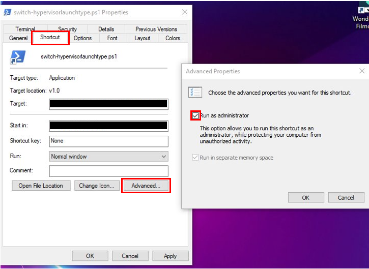

# Switch Hypervisor

## Overview

This PowerShell script is designed to toggle the Hypervisor Launch Type configuration on Windows. It uses the `bcdedit` command to check the current configuration and switches it between "auto" and "off." This can be useful for users who need to adjust virtualization settings on their Windows machine.

## Usage

1. **Copy `hypervisor-swhitch.ps1` in a folder**

   - Create folder in the desired folder.
   - Open https://raw.githubusercontent.com/felixcapuano/hypervisor-switch/main/hypervisor-switch.ps1
   - Right click on the page and `Save as...` in the desired folder.
   - Note somewhere the path of the script, example : **C:\path\to\hypervisor-switch.ps1**

Feel free to customize the README according to your specific requirements or add more detailed instructions if needed.

1. **Create a Windows Shortcut:**

   - Right-click on your desktop or in the desired folder.
   - Select "New" -> "Shortcut."
   - Pick the tab Shortcut
   - Input this command in **Target** field and make sure to replace the script path(noted before 1.) in the commands.

   | field      | value                                                                                                  |
   | ---------- | ------------------------------------------------------------------------------------------------------ |
   | **Target** | C:\Windows\System32\WindowsPowerShell\v1.0\powershell.exe -File "**C:\path\to\hypervisor-switch.ps1**" |

   

1. **Run as Administrator:**

   - Right-click on the shortcut you just created.
   - Select "Properties."
   - In the "Shortcut" tab, click "Advanced."
   - Check the option "Run as administrator."
   - Click "OK" to apply the changes.

1. **Execute the Script:**

   - Double-click on the shortcut to run the PowerShell script.
   - If prompted, confirm that you want to run the script as an administrator.

1. **Restart the Computer:**
   - The script will toggle the Hypervisor Launch Type and prompt you to restart the computer to apply the changes.
   - Save any unsaved work before restarting.

## Important Notes

- This script modifies system settings and requires administrative privileges. Ensure that you run it as an administrator to avoid any issues.
- The script includes a `Restart-Computer` command, so be prepared for an automatic restart after running the script.

# Licence

MIT License
